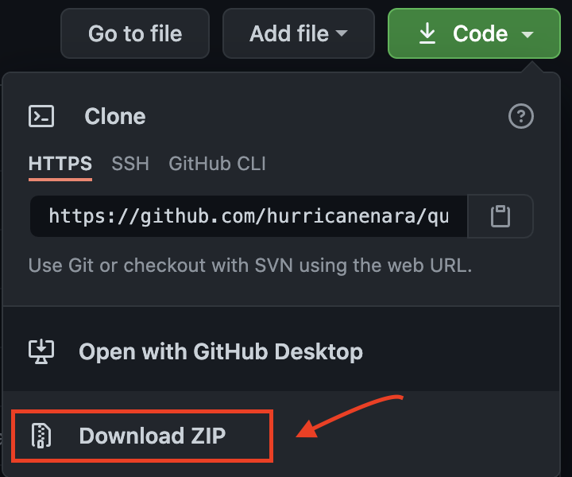
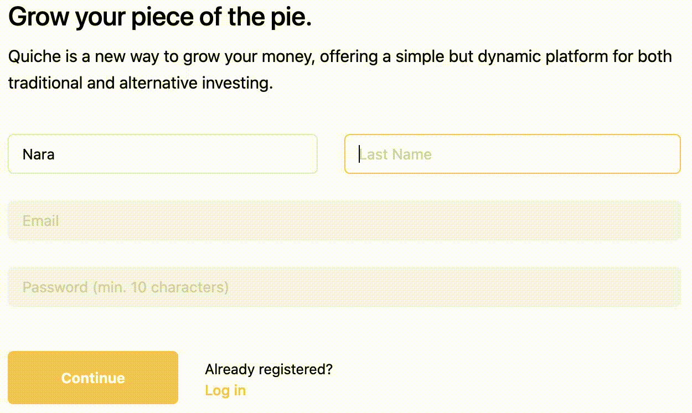
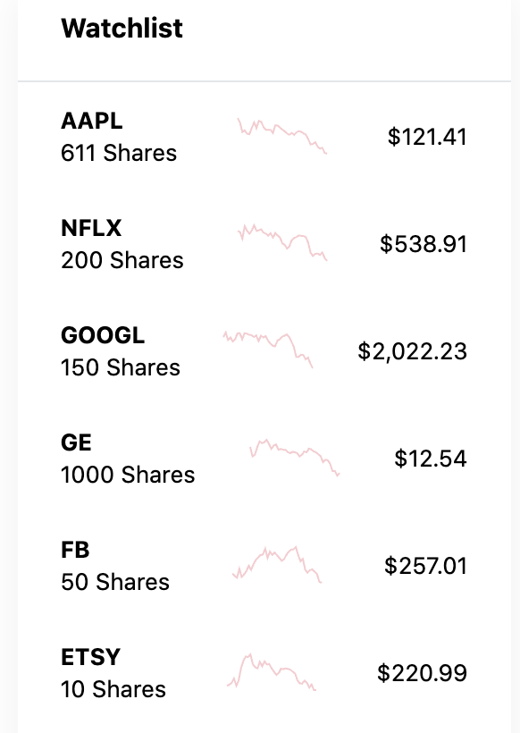
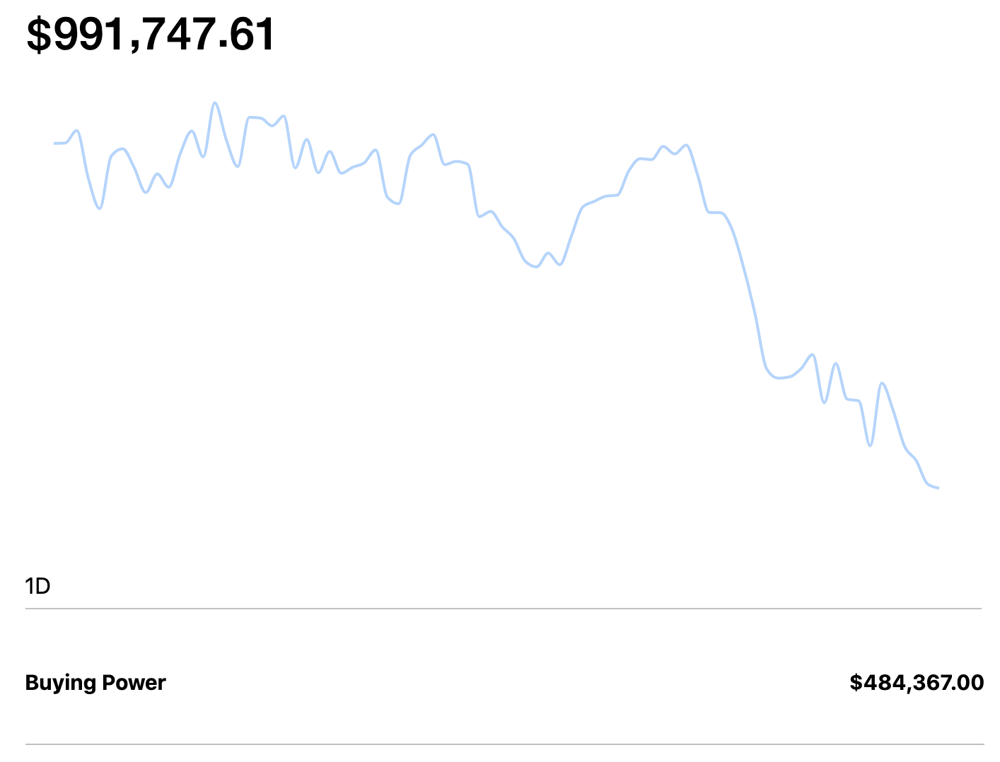
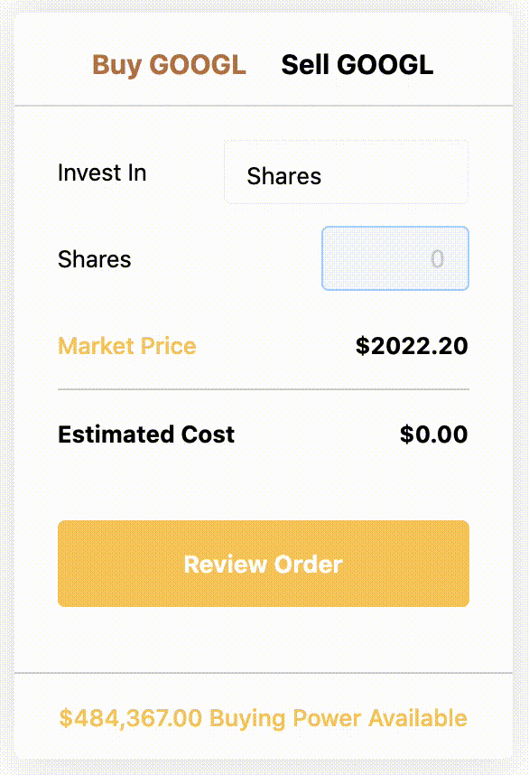
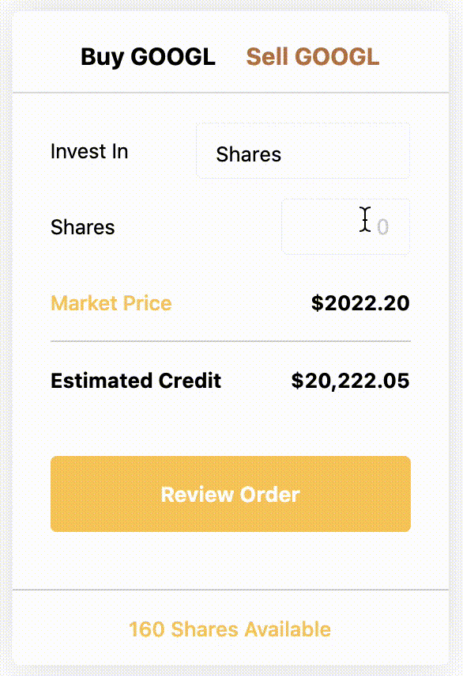
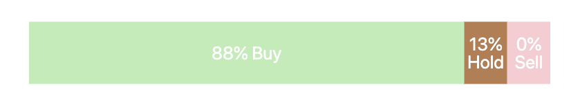
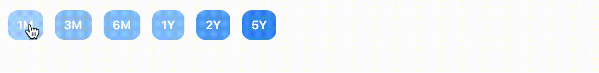

<div align="center">
    <h1 >
        Quiche
    </h1>
    <p>
        
    </p>
    <a href="https://quichelite.herokuapp.com/#/us/en">Live Demo</a>
    ·
    <a href="https://github.com/hurricanenara/quiche/issues">Report Bug</a>

</div>

<details open="open">
  <summary>Table of Contents</summary>
  <ol>
    <li>
      <a href="#about-the-project">About The Project</a>
      <ul>
        <li><a href="#built-with">Built With</a></li>
      </ul>
    </li>
    <li>
      <a href="#getting-started">Getting Started</a>
      <ul>
        <li><a href="#prerequisites">Prerequisites</a></li>
        <li><a href="#installation">Installation</a></li>
      </ul>
    </li>
    <li><a href="#usage">Usage</a></li>
    <li><a href="#contact">Contact</a></li>
  </ol>
</details>
<br>


<!-- About -->
## About The Project
---

<!-- [![Product Name Screen Shot][product-screenshot]](https://example.com) -->

Quiche is a fullstack financial and data website based on Robinhood trading app.

With Quiche, you can simulate buying and selling of NYSE and NASDAQ listed securities.
Unfortunately, the $$$ you will be deposited can't be taken away, but here's what you can take away:

* Portfolio tracking with reliable data fetched from the best financial data platform
* Speedy and accurate buying and selling
* Gliding smooth historical price charts in multiple ranges
* Aesthetically soothing pastel themed pages

<br>

### Built With

This section should list any major frameworks that you built your project using. Leave any add-ons/plugins for the acknowledgements section. Here are a few examples.
* [Ruby on Rails](https://rubyonrails.org/)
* [PostgreSQL](https://www.postgresql.org/)
* [React](https://reactjs.org/)
* [Redux](https://redux.js.org/)

<!-- GETTING STARTED -->
## Getting Started
---
Quiche is availalbe on the web here:
<a href="https://quichelite.herokuapp.com/#/us/en">Live Demo</a>.

If running on a local machine is preferred, follow the instructions below.

### Installation

1. Clone the repo
    ```sh
    git clone https://github.com/hurricanenara/quiche.git
    ```
    or down load from repository home: 
    

2. Install necessary modules and packages by running
    ```sh
    npm install
    ```
3. Then from the root of the project folder, run in two different terminals
    ```sh
    npm start
    ```
    ```sh
    rails server
    ```
4. Upon successful start of npm and rails server, Quiche will be served on
    ```sh
    http://localhost:6464/
    ```


<!-- USAGE EXAMPLES -->
## Usage
---
<details open="open">
  <summary>At a Glance</summary>
  <ol>
        <details open="open">
            <summary>Registration</summary>
                <ul>
                    <li><a href="#sign-up">Sign Up</a></li>
                    <li><a href="#sign-in">Sign In</a></li>
                </ul>
        </details>
        <details open="open">
            <summary>Dashboard</summary>
                <ul>
                    <li><a href="#portfolio">Portfolio</a></li>
                    <!-- <li><a href="#watchlist">Watchlist</a></li> -->
                </ul>
        </details>
        <details open="open">
            <summary>Security</summary>
                <ul>
                    <li><a href="#buy">Buy</a></li>
                    <li><a href="#sell">Sell</a></li>
                    <li><a href="#charts">Charts</a></li>
                    <!-- <li><a href="#news">News</a></li> -->
                    <li><a href="#analyst-ratings">Analyst Ratings</a></li>
                    <li><a href="#hindsight">Hindsight</a></li>
                </ul>
        </details>
  </ol>
</details>

### Registration
#### Sign Up

<br>
<br>

#### Sign In

<br>
<br>

---

### Dashboard

<!-- #### Watchlist

<br>
<br> -->

#### Portfolio

<br>
<br>

---
### Security

#### Buy

<br>

#### Sell

<br>

#### Charts

<br>

#### Analyst Ratings

<br>

#### Hindsight

<br>

<!-- ACKNOWLEDGEMENTS -->
## Acknowledgements
---
* [GitHub Pages](https://pages.github.com)
* [IEX Cloud](https://iexcloud.io/)
* [Postman](https://www.postman.com/)
* [Cron To Go](https://iexcloud.io/)
* [Best-README-Template](https://github.com/othneildrew/Best-README-Template#license)
* [Font Awesome](https://fontawesome.com)